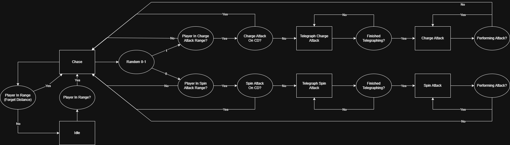

# PolRobledillo_ACT5_Run-Catch

## Descripción general

Para esta práctica se ha creado una **máquina de estados** que controla el comportamiento de un enemigo dentro del juego.

El enemigo cuenta con la capacidad de **perseguir al jugador** haciendo uso del **NavMesh de Unity**, lo que le permite desplazarse de forma inteligente por el escenario.

## Comportamientos del enemigo

El enemigo puede ejecutar **dos tipos de ataques**, cada uno con indicadores visuales previos que permiten al jugador anticiparse y esquivarlos:

- **Carga frontal**  
  Un ataque directo hacia el jugador tras un breve aviso.

- **Ataque giratorio**  
  Un ataque de área en el que el enemigo gira sobre sí mismo, también precedido por una señal visual.

Estos indicadores previos están diseñados para mejorar la jugabilidad y dar al jugador una oportunidad justa de reacción.

## Máquina de estados

A continuación se muestra el **diagrama de la máquina de estados** que define los distintos comportamientos y transiciones del enemigo:

